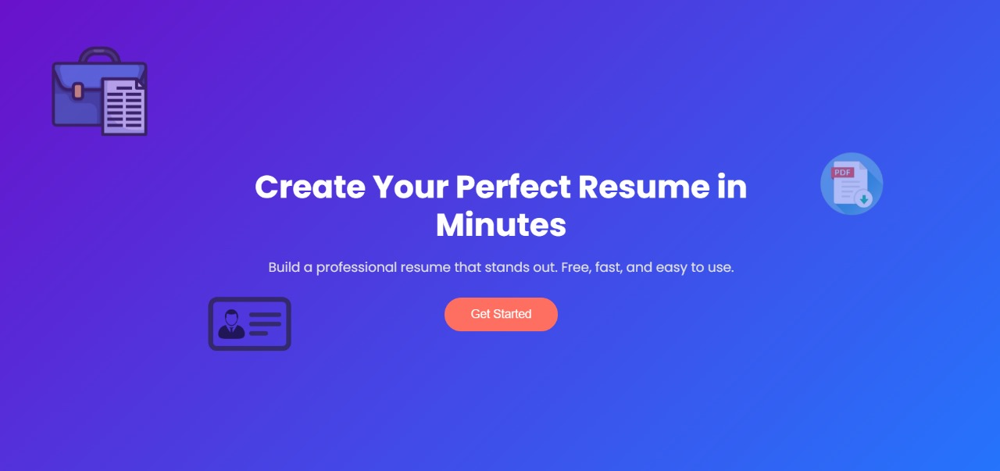
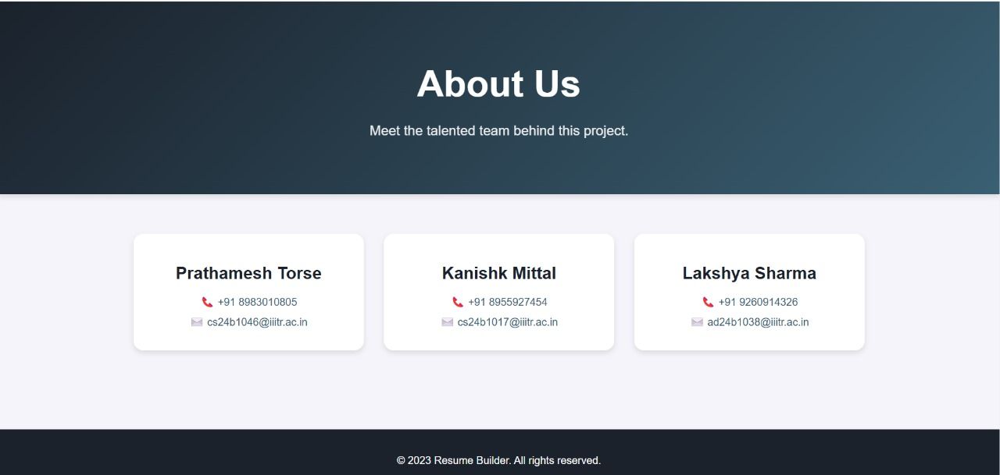

# Accessible Resume Builder

## Problem Statement
Many online resume builders are cluttered, not mobile-friendly, and lack accessibility features for users with disabilities. This tool helps create clean, professional resumes with accessibility in mind.

## Features
- **Responsive Design**: Works seamlessly on both mobile and desktop.
- **User-Friendly Form**: Easy-to-fill form with live preview.
- **Accessibility Features**: Supports keyboard navigation and screen readers.
- **Download Option**: Export resume as a PDF.

## Tech Stack
- **HTML**: Structure and content of the resume builder.
- **CSS**: Styling for responsiveness and accessibility.

## Deployment

1. We have deployed using github pages.
2. Link for the website is - https://space-dev0.github.io/code-conflux-2025/

## Usage
1. Fill in your resume details in the form.
2. Preview your resume live.
3. Download the resume as a PDF.

## Screenshots
### Landing Page

### Main Page
.gif)
### About

## Accessibility Considerations
- **Keyboard Navigation**: Users can navigate using the keyboard.
- **Screen Reader Support**: Proper ARIA labels and semantic HTML elements are used.
- **Contrast & Font Adjustments**: Ensures readability for all users.

